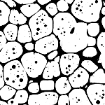

.. _ex_from_image:

=========================
Microstructure from Image
=========================

.. note::

  The open source and freely available software package OOF is better equiped
  to create unstructured meshes from images.

  https://www.ctcms.nist.gov/oof/

Python Script
=============

The basename for this file is ``from_image.py``.
The file can be run using this command::

    microstructpy --demo=from_image.py

The full text of the script is:

.. literalinclude:: ../../../../src/microstructpy/examples/from_image.py
    :language: python

Read Image
==========

The first section of the script reads the image using matplotlib.
The brightness of the image is taken as the red channel, since the RGB values
are equal. That image is shown in :numref:`f_ex_image_in`.

.. _f_ex_image_in:

  Micrograph of aluminum.

Bin Pixels
==========

The pixel values are binned based on whether the brightness is above or
below 0.5.

Phases
======

The two phases are considered amorphous, to prevent pixilation in the
triangle mesh.

Create the Polygon Mesh
=======================

The polygon mesh is a reproduction of the pixel grid in the image.
The facets are edges between pixels, and the polygons are all squares.

Create the Triangle Mesh
========================

The triangle mesh is created from the polygon mesh and uses the amorphous
specifications for the phases. The minimum interior angle of the triangles
is set to 20 degrees to control the aspect ratio of triangles.

Plot Triangle Mesh
==================

The axes of the plot are switched off, then the triangle mesh is plotted.
The color of each triangle is set by the phase.

Save Plot and Copy Input File
=============================

The final plot is saved to a file, then the input image is copied to the
same directory for comparison.
The output PNG file of this script is shown in :numref:`f_ex_image_out`.

.. _f_ex_image_out:
.. figure:: ../../../../src/microstructpy/examples/from_image/trimesh.png
  :alt: Triangular mesh of aluminum microstructure.

  Triangular mesh of aluminum microstructure.

